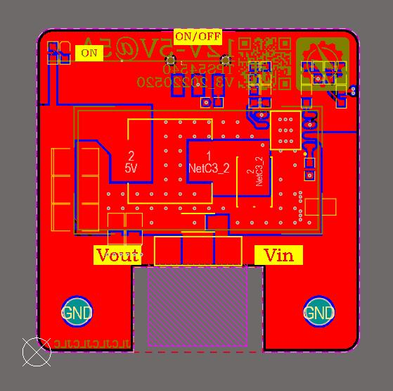
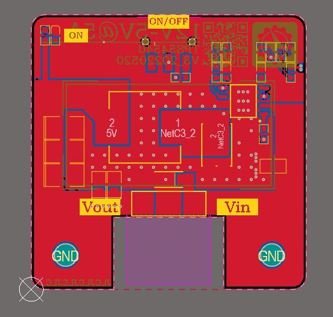

## **AD-Color**
 基于中国风配色的Altium Designer配色，相较于标准色更加柔和，长时间使用不伤眼睛

<figure class="half">
    
    
</figure>

---

## **导入方法**
[Altium Designer中导入和导出设置的方法]("https://blog.csdn.net/weixin_44056757/article/details/108187362")

---

## **Q&A**
保护眼睛从我做起！

---
